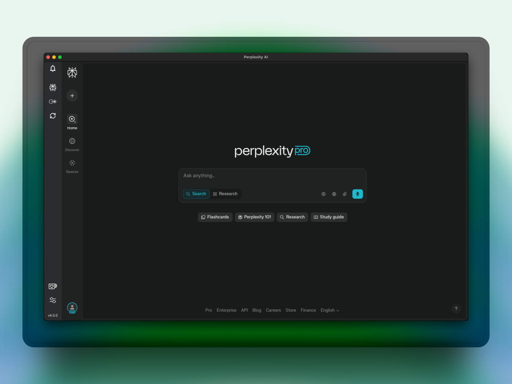
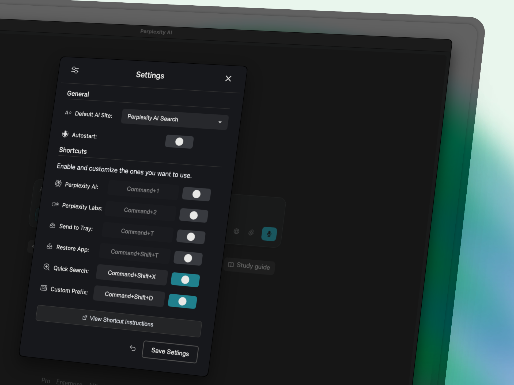
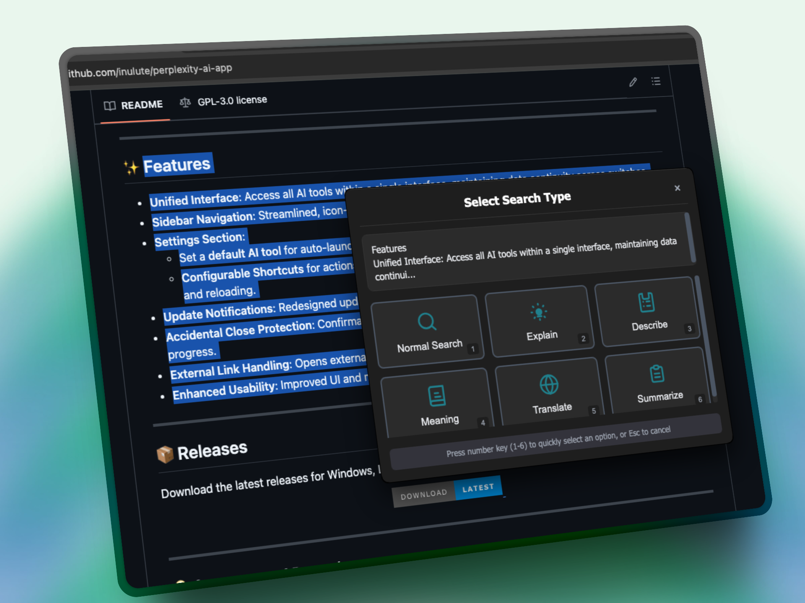

<h1 align="center">🚀 Perplexity AI Desktop App 🖥️</h1>

<div align="center">
  

</div>

---

 <p align="center">
  A powerful, streamlined desktop application for Perplexity AI, providing seamless navigation between 🌐 <b>perplexity.ai</b> and 🧪 <b>labs.perplexity.ai</b> with enhanced features and an intuitive interface.
</p>

<p align="center">
<a href="https://pplx.inulute.com/download/">
    
</a>
</p>
  
<div align="center">
  <br>
  
  <br><br>
</div>


> [!NOTE]  
> This is an Unofficial App - Not affiliated with Perplexity AI.

---

## ⚡ Perplexity — v4.0.0

A complete build focused on performance, usability, and integration.

```js
/* What's new in v4.0.0 */
await perplexity.evolve({
  retainState: true,           // Persistent session memory
  systemTrayHibernation: true, // Minimize to system tray
  keyboardIntegration: true,   // Advanced shortcuts
  autostart: true,             // Launch on system boot
  quickSearchCapabilities: true,    // Qucik searching
  unifiedInterface: true       // Seamless navigation between tools
});
```

---

## 🔮 CORE FEATURES

<table>
<tr>
<td width="50%">

### 🚀 Performance
- Launches in seconds
- Responsive interface
- Optimized resource usage

### 🧠 Persistence
- Minimizes to system tray
- Preserves your entire session
- One-click restoration

### ⚙️ Autostart
- Launches on system boot
- Ready before you need it

</td>
<td width="50%">

### ⌨️ Keyboard Control
- Comprehensive shortcuts
- Fully customizable
- Efficient workflow integration

### 🔍 Contextual Search
- Highlight text anywhere
- Instant answers without interruptions
- Information exactly when needed

### 🖥️ Unified Interface
- Access all AI tools in one place
- Data continuity across switches
- Streamlined navigation

</td>
</tr>
</table>

---

<table>
<tr>
<td></td>
<td></td>
<td></td>
</tr>
<tr>
<td><em>Home Screen</em></td>
<td><em>Settings Panel</em></td>
<td><em>Quick Search/Prefix Search</em></td>
</tr>
</table>


---

## 🖥️ INSTALLATION

<div align="center">
  <table>
    <tr>
      <td align="center">
        <a href="https://pplx.inulute.com/download/">
          
        </a>
      </td>
      <td align="center">
        <a href="https://pplx.inulute.com/download/">
          
        </a>
      </td>
      <td align="center">
        <a href="https://pplx.inulute.com/download/">
          
        </a>
      </td>
    </tr>
  </table>
</div>

---

## 💎 SUPPORT THE PROJECT

<div align="center">

  
  <a href="https://support.inulute.com">
    
  </a>

  <p>If this application enhances your productivity, consider supporting further development.</p>

</div>

---

## 🌐 CONNECT

<div align="center">
  <a href="https://socials.inulute.com">
    
  </a>

  <p>Stay updated with the latest news and features.</p>

</div>

---

<div align="center">
  
  
</div>

---

 [!NOTE]  
> <sub> This application is not affiliated with the official Perplexity AI project but is an independent effort to bring Perplexity AI to your desktop.</sub>