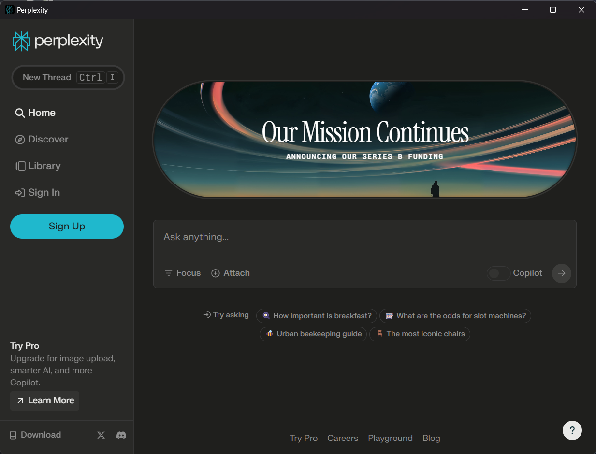

  

<h1 align="center">🚀 Perplexity AI Desktop App 🖥️</h1>

  A beautifully crafted desktop application for Perplexity AI, an advanced artificial intelligence (AI) platform created and brought to life by the Perplexity team. This app provides seamless navigation between 🌐 <b>perplexity.ai</b> and 🧪 <b>labs.perplexity.ai</b>.

  

  

<h2>✨ Features</h2>
<ul>
  <li><b>Website Navigation:</b> Choose between 🌐 <b>perplexity.ai</b> and 🧪 <b>labs.perplexity.ai</b>.</li>
  <li><b>User-Friendly Interface:</b> Designed for simplicity and ease of use.</li>
  <li><b>Cross-Platform Compatibility:</b> Built with Electron to work seamlessly on multiple platforms.</li>
  <li><b>Keyboard Shortcuts:</b>
    <ul>
      <li><b>CmdOrCtrl+6:</b> Open or restore the Perplexity AI window.</li>
      <li><b>CmdOrCtrl+7:</b> Open or restore the Perplexity Labs window.</li>
      <li><b>CmdOrCtrl+M:</b> Minimize or restore all windows.</li>
    </ul>
  </li>
</ul>

<h2>📦 Releases</h2>

  Download the latest releases for Windows, Linux, and Mac from the <a href="https://github.com/inulute/perplexity-ai-app/releases">releases section</a>.

   &nbsp;
  

<h2>📚 Content</h2>

  The Perplexity AI Desktop App provides a seamless browsing experience between:

<ol>
  <li><b>🌐 perplexity.ai:</b> Access the main website for Perplexity AI, an AI-powered search engine.</li>
  <li><b>🧪 labs.perplexity.ai:</b> Explore Perplexity AI Labs, a chat-based AI.</li>
</ol>

<h2>💡 Support and Donations ❣️</h2>

  If you find this project helpful, consider supporting us by making a donation. Your contributions help maintain and improve the Perplexity AI Desktop App.

  
  
  

> [!NOTE]  
> UPI is only available for Indian users.

<h2>🗃️ License</h2>

  This project is licensed under the MIT License. See the <a href="LICENSE">LICENSE</a> file for details.

<h2>🙌 Acknowledgments</h2>

  A big thank you to the open-source community for providing amazing tools and libraries that made this project possible.

> [!NOTE]
> This application is not affiliated with the official Perplexity AI project but is an independent endeavor that brings the magic of AI language processing to your desktop.

<h2>📢 Feedback and Contributions</h2>

  We warmly welcome your feedback and contributions to improve the Perplexity AI Desktop App. If you encounter any issues or have ideas for enhancements, please submit them through GitHub issues or create a pull request. 😊

---

  
<b>Made with ❤️ by</b>

  

<h2>🌐 Connect with Us</h2>

  
  
  
  

