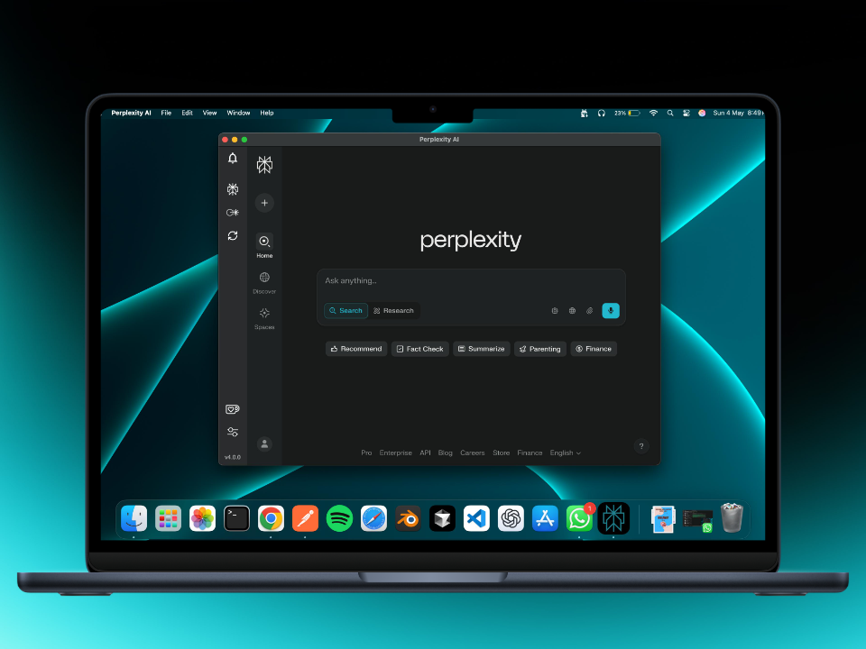
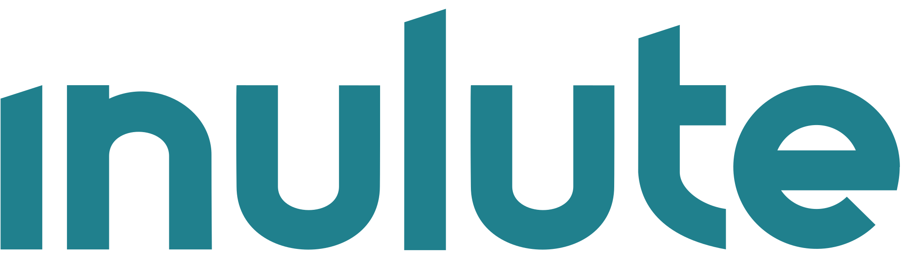

<div align="center">

# 🚀 SimplexityAI

### *Community-built P-lexity AI Desktop App*

<!--  -->

[](https://www.pling.com/p/2107698/)
[](https://www.gnu.org/licenses/gpl-3.0)
[](https://github.com/inulute/simplexity-ai-app/stargazers)

<br>

**A powerful, feature-rich desktop app for accessing P-lexity AI's web service**
*Built with ❤️ by the community, for the community*

<br>



</div>

---

## ⚠️ **IMPORTANT DISCLAIMER**

> [!WARNING]
> **SimplexityAI is an UNOFFICIAL, community-built desktop application.**
>
> - ❌ **NOT affiliated with, endorsed by, or connected to P-lexity AI, Inc.**
> - ❌ **NOT an official product of P-lexity AI, Inc.**
> - ✅ **Independent open-source project** built by developers for desktop convenience
> - ✅ **Provides desktop wrapper features** for P-lexity's existing web service
>
> This application simply loads P-lexity AI's public website (P-lexity.ai) in a native desktop container with added convenience features. All AI search functionality is powered by P-lexity AI's web service.
>
> **P-lexity®** is a registered trademark of P-lexity AI, Inc. This project has no affiliation with them.

---

## ✨ Why SimplexityAI?

Transform your AI search experience with native desktop features that the web browser can't provide:

<table>
<tr>
<td width="33%" align="center">

### ⚡ Lightning Fast
Launch in seconds, minimize to tray,
instant access when you need it

</td>
<td width="33%" align="center">

### 🎯 Always Ready
Auto-start on boot, global shortcuts,
search from anywhere on your desktop

</td>
<td width="33%" align="center">

### 🔒 Native & Secure
Electron-based, fully sandboxed,
your data stays with P-lexity AI

</td>
</tr>
</table>

---

## 🎨 Features That Matter

### 🖥️ **Native Desktop Experience**
- **System Tray Integration** — Minimize to tray, keep app running in background
- **Auto-Start on Boot** — Launch automatically when your computer starts
- **Window State Memory** — Remembers size, position, and your last session
- **Persistent Sessions** — Pick up exactly where you left off
- **Cross-Platform** — Windows, macOS, and Linux support

### ⌨️ **Powerful Keyboard Shortcuts**
- **Global Quick Search** — Highlight text anywhere, press hotkey, instant answers
- **Customizable Shortcuts** — Remap every action to your preference
- **Workflow Integration** — Access AI search without leaving your current app
- **Prefix Search** — Pre-configure search templates for repeated queries
- **Find in Page** — Built-in Ctrl+F search with match highlighting (just like your browser!)

### 🔍 **Enhanced Search Features**
- **Integrated Find Bar** — Press Ctrl/Cmd+F to search within results
- **Quick Navigation** — Seamlessly switch between P-lexity AI and P-lexity Labs
- **One-Click Refresh** — Restart your session with a single click
- **Zoom Controls** — Adjust text size with Ctrl +/- for better readability

### 🎯 **Smart Notifications**
- **In-App Updates** — Get notified about new SimplexityAI features
- **Version Tracking** — Always know when updates are available
- **Notification Center** — Manage all alerts in one place

### 🛡️ **Privacy & Security**
- **No Data Collection** — SimplexityAI collects zero user data
- **Sandboxed Environment** — Secure Electron architecture
- **Local Settings** — All preferences stored locally on your device
- **Direct to P-lexity** — All searches go directly to P-lexity AI's servers

### 🎨 **Modern UI**
- **Custom Branding** — Unique SimplexityAI design (bright blue #5BEBFF theme)
- **Dark Mode Native** — Respects P-lexity's dark theme
- **Minimal Sidebar** — Clean, distraction-free interface
- **Smooth Animations** — Polished user experience

---

## 📥 Installation

<div align="center">

### Choose Your Platform

<table>
  <tr>
    <td align="center" width="33%">
      <a href="https://www.pling.com/p/2107698/" target="_blank">
        
      </a>
      <br><br>
      <code>.exe</code> installer
      <br>
      <sub>Windows 10/11 (64-bit)</sub>
    </td>
    <td align="center" width="33%">
      <a href="https://www.pling.com/p/2107698/" target="_blank">
        
      </a>
      <br><br>
      <code>.dmg</code> package
      <br>
      <sub>macOS 10.13+ (Intel & Apple Silicon)</sub>
    </td>
    <td align="center" width="33%">
      <a href="https://www.pling.com/p/2107698/" target="_blank">
        
      </a>
      <br><br>
      <code>.AppImage</code> / <code>.deb</code>
      <br>
      <sub>Ubuntu, Debian, Fedora, Arch</sub>
    </td>
  </tr>
</table>

### [📦 Download Latest Release](https://www.pling.com/p/2107698/)

</div>

---

## 🚀 Quick Start

### Option 1: Download from Pling (Recommended)
**Why recommended:** Downloads via Pling support the project indirectly, so choosing this option helps keep SimplexityAI maintained and updated.

1. Go to the **[Simplexity AI page on Pling](https://www.pling.com/p/2107698/)**.
2. Download the installer for your platform (Windows `.exe`, macOS `.dmg`, or Linux `.AppImage`/`.deb`).
3. Install and launch SimplexityAI.
4. Start searching! 🎉

If you'd like to support the project indirectly, please consider downloading Simplexity AI via Pling:

<p align="center">
  <a href="https://www.pling.com/p/2107698/" target="_blank">
    
  </a>
</p>

### Option 2: Direct Download from GitHub Releases
1. Go to the **[GitHub Releases](https://github.com/inulute/simplexity-ai-app/releases)** page.
2. Download the installer for your platform (Windows `.exe`, macOS `.dmg`, or Linux `.AppImage`/`.deb`).
3. Install and launch SimplexityAI.
4. Start searching! 🎉

### Option 3: Build from Source

**Prerequisites:**
- Node.js 16+ ([Download](https://nodejs.org/))
- Git ([Download](https://git-scm.com/))

**Clone and Build:**
```bash
# Clone the repository
git clone https://github.com/inulute/simplexity-ai-app
cd simplexity-ai-app

# Install dependencies
npm install

# Run in development mode
npm start

# Build for your platform (auto-detects OS)
npm run package-auto

# Or build for specific platform
npm run package-win   # Windows
npm run package-mac   # macOS
npm run package-linux # Linux
```

**Manual Build Commands:**
```bash
npm run package-win    # Creates .exe installer (Windows)
npm run package-mac    # Creates .dmg package (macOS)
npm run package-linux  # Creates .AppImage and .deb (Linux)
```

---

## ⌨️ Keyboard Shortcuts

All shortcuts are **fully customizable** in Settings!

### Default Shortcuts

| Action | Windows/Linux | macOS | Description |
|--------|---------------|-------|-------------|
| **Quick Search** | `Alt+Shift+X` | `Cmd+Shift+X` | Search selected text from anywhere |
| **Custom Prefix Search** | `Alt+Shift+D` | `Cmd+Shift+D` | Search with custom prefixes |
| **Open P-lexity AI** | `Ctrl+1` | `Cmd+1` | Switch to P-lexity AI |
| **Open P-lexity Labs** | `Ctrl+2` | `Cmd+2` | Switch to P-lexity Labs |
| **Send to Tray** | `Alt+Shift+W` | `Cmd+T` | Minimize to system tray |
| **Restore from Tray** | `Alt+Shift+Q` | `Cmd+Shift+T` | Restore app window |
| **Find in Page** | `Ctrl+F` | `Cmd+F` | Search text on current page |
| **Zoom In** | `Ctrl+=` | `Cmd+=` | Increase text size |
| **Zoom Out** | `Ctrl+-` | `Cmd+-` | Decrease text size |
| **Reset Zoom** | `Ctrl+0` | `Cmd+0` | Reset to default size |

> 💡 **Tip:** Press `Ctrl+F` (or `Cmd+F` on Mac) to open the integrated find bar and search within your results!

---

## 🎯 Key Features Explained

### 🔍 **Quick Search**
Highlight any text on your desktop → Press your Quick Search hotkey → Instant AI search results

**How it works:**
1. Select text anywhere (browser, document, email, etc.)
2. Press `Alt+Shift+X` (Windows/Linux) or `Cmd+Shift+X` (macOS)
3. SimplexityAI opens with your search ready!

### 📋 **Prefix Search**
Create custom search templates for repeated query patterns

**Examples:**
- "Explain:" → Automatically prefixes "Explain:" to your selection
- "Summarize:" → Quick summaries of highlighted text
- "Translate:" → Instant translation requests

### 🔔 **System Tray**
Keep SimplexityAI running in the background for instant access

**Features:**
- Click X button → Minimizes to tray (configurable)
- Right-click tray icon → Quick actions menu
- Restore with global hotkey or tray icon click

### 🎨 **Find in Page**
Built-in search functionality just like your web browser

**Features:**
- Press `Ctrl+F` to open find bar at the top
- Type to search and see matches highlighted in real-time
- Navigate with Enter (next) / Shift+Enter (previous)
- Match count display (e.g., "3 / 15")
- Press Escape to close

### ⚙️ **Auto-Start**
Launch SimplexityAI automatically when your computer boots

**Benefits:**
- Always ready when you need it
- No manual launching required
- Starts minimized in tray (optional)

---

## 🛠️ Settings & Customization

Access settings by clicking the ⚙️ icon in the sidebar.

### Available Settings:

- **Default AI Site** — Choose which P-lexity service loads on startup (AI Search or Labs)
- **Auto-Start** — Enable/disable launch on system boot
- **Close to Tray** — Choose whether X button minimizes to tray or quits app
- **Keyboard Shortcuts** — Customize all global shortcuts
- **Notifications** — Manage in-app notification preferences

---

## 🔧 Technical Details

### Built With
- **Electron** — Cross-platform desktop framework
- **Node.js** — Backend runtime environment
- **HTML/CSS/JavaScript** — Modern web technologies
- **electron-store** — Persistent settings storage
- **electron-window-state** — Window state persistence

### Architecture
- **Main Process** — Native OS integration, window management
- **Renderer Process** — UI rendering, user interactions
- **BrowserView** — Embedded P-lexity AI web content
- **IPC Communication** — Secure inter-process messaging

### System Requirements

**Windows:**
- Windows 10/11 (64-bit)
- 4GB RAM minimum
- 200MB disk space

**macOS:**
- macOS 10.13 High Sierra or newer
- Intel or Apple Silicon processor
- 4GB RAM minimum
- 200MB disk space

**Linux:**
- Ubuntu 18.04+, Debian 10+, Fedora 32+, or equivalent
- 4GB RAM minimum
- 200MB disk space
- X11 or Wayland display server

---

## 🤝 Contributing

Contributions are welcome! Here's how you can help:

### Ways to Contribute
- 🐛 **Report Bugs** — Open an issue with detailed reproduction steps
- 💡 **Suggest Features** — Share your ideas for new features
- 🔧 **Submit PRs** — Fix bugs or implement new features
- 📖 **Improve Docs** — Help make the documentation better
- ⭐ **Star the Repo** — Show your support!

### Development Setup
```bash
git clone https://github.com/inulute/simplexity-ai-app
cd simplexity-ai-app
npm install
npm start
```

---

## 💎 Support the Project

SimplexityAI is **free and open-source**, built and maintained by independent developers.

<div align="center">

If this app saves you time and boosts your productivity, consider supporting its continued development:

<br>

<a href="https://support.inulute.com">
  
</a>

<br><br></div>

**Your support helps:**


- 🚀 Fund new features and improvements
- 🐛 Maintain and fix bugs quickly
- 📚 Create better documentation
- 🌍 Keep the project alive and growing


---

## 🌐 Connect & Community

<div align="center">

Stay updated with the latest features, tips, and community discussions:

<br>

[](https://socials.inulute.com)
[](https://t.me/inuluteprojects)
[](https://github.com/inulute)

</div>

---

## 📜 License

This project is licensed under the **GNU General Public License v3.0**

```
SimplexityAI - Community-built Desktop Wrapper for P-lexity AI
Copyright (C) 2024-2026  Inulute

This program is free software: you can redistribute it and/or modify
it under the terms of the GNU General Public License as published by
the Free Software Foundation, either version 3 of the License, or
(at your option) any later version.

This program is distributed in the hope that it will be useful,
but WITHOUT ANY WARRANTY; without even the implied warranty of
MERCHANTABILITY or FITNESS FOR A PARTICULAR PURPOSE.
```

See [LICENSE](LICENSE) for full details.

---

## 🔒 Privacy & Security

- ✅ **No telemetry or tracking** — SimplexityAI collects zero user data
- ✅ **No ads or analytics** — Completely clean experience
- ✅ **Local-only settings** — All preferences stored on your device
- ✅ **Direct to P-lexity** — Searches go straight to P-lexity AI's servers
- ✅ **Open source** — Fully transparent, auditable code

---

## ❓ FAQ

<details>
<summary><strong>Q: Is this affiliated with P-lexity AI, Inc.?</strong></summary>
<br>
<b>A: No.</b> SimplexityAI is an independent, unofficial, community-built desktop wrapper. It is NOT affiliated with, endorsed by, or connected to P-lexity AI, Inc. in any way.
</details>

<details>
<summary><strong>Q: How does SimplexityAI work?</strong></summary>
<br>
<b>A:</b> SimplexityAI is a desktop application that loads P-lexity AI's public website (P-lexity.ai) in an embedded browser view. All search functionality is powered by P-lexity AI's web service. We add desktop-specific features like system tray, global shortcuts, and persistent sessions.
</details>

<details>
<summary><strong>Q: Do I need a P-lexity account?</strong></summary>
<br>
<b>A:</b> SimplexityAI works with both free and premium P-lexity accounts. You can use it without an account for basic searches, or sign in for full P-lexity Pro features (if you have a subscription).
</details>

<details>
<summary><strong>Q: Is my data safe?</strong></summary>
<br>
<b>A:</b> Yes! SimplexityAI doesn't collect any user data. All your searches and interactions go directly to P-lexity AI's servers. Your settings are stored locally on your device.
</details>

<details>
<summary><strong>Q: Why use SimplexityAI instead of the browser?</strong></summary>
<br>
<b>A:</b> SimplexityAI offers desktop-specific features that browsers can't provide: system tray integration, global keyboard shortcuts (search from anywhere!), auto-start on boot, persistent sessions, and a dedicated distraction-free interface.
</details>

<details>
<summary><strong>Q: Can I customize the keyboard shortcuts?</strong></summary>
<br>
<b>A:</b> Yes! All keyboard shortcuts are fully customizable in the Settings panel. Click the ⚙️ icon in the sidebar to access settings.
</details>

<details>
<summary><strong>Q: Does this work offline?</strong></summary>
<br>
<b>A:</b> No. SimplexityAI requires an internet connection since it accesses P-lexity AI's web service. The app itself can run offline, but you won't be able to perform searches.
</details>

<details>
<summary><strong>Q: How do I update SimplexityAI?</strong></summary>
<br>
<b>A:</b> The app checks for updates automatically. When a new version is available, you'll see a notification. Click to download and install the latest version.
</details>

---

## 🙏 Acknowledgments

- **P-lexity AI** — For creating an amazing AI search service (this is just a desktop wrapper!)
- **Electron** — For the cross-platform desktop framework
- **Open Source Community** — For all the amazing libraries and tools
- **Contributors** — Everyone who has helped improve this project

---

<div align="center">

### 🌟 If SimplexityAI helps you, give it a star! 🌟

**Made with ❤️ by [Inulute](https://github.com/inulute)**

<br>



<br><br>

[](https://github.com/inulute/simplexity-ai-app/stargazers)
[](https://github.com/inulute/simplexity-ai-app/network/members)

<br>

---

**SimplexityAI** • [Website](https://simplexity.inulute.com) • [Download on Pling](https://www.pling.com/p/2107698/) • [GitHub](https://github.com/inulute/simplexity-ai-app) • [Support](https://support.inulute.com)

<sub>Not affiliated with any AI, INC. • Independent open-source project</sub>

</div>
