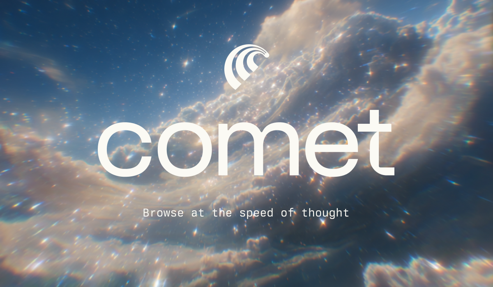

# ☄️ Perplexity’s Comet - 1 Month of Pro, Free  

Perplexity’s new **Comet Browser** is redefining how we explore the web — fast, focused, and powered by AI.  

For a limited time, you can grab **1 month of Perplexity Pro FREE** when you register through **link below**.  
No auto-renewals. No hidden steps. Just pure access to the best of AI.  

---

### 💡 How to Claim  
1. Tap the link 👉 [Try Comet + Free Month](https://pplx.ai/rishabhanand)  
2. Download & sign in to Comet
3. Ask a question on Comet.  
4. Your free **1-month Pro access** activates automatically 🌟  

---

### 🌟 Why Try Comet
- Access **GPT-5**, **Claude 4**, and top AI models directly in your browser  
- Instant answers, webpage summaries, and ad-free experience  
- Sleek, distraction-free design focused on you  

---

Joining via the above link also helps **support Inulute’s development** - allowing us to keep improving, maintaining, and innovating 💙  

---

🕒 *Limited-time offer — claim yours before it’s gone!*  
