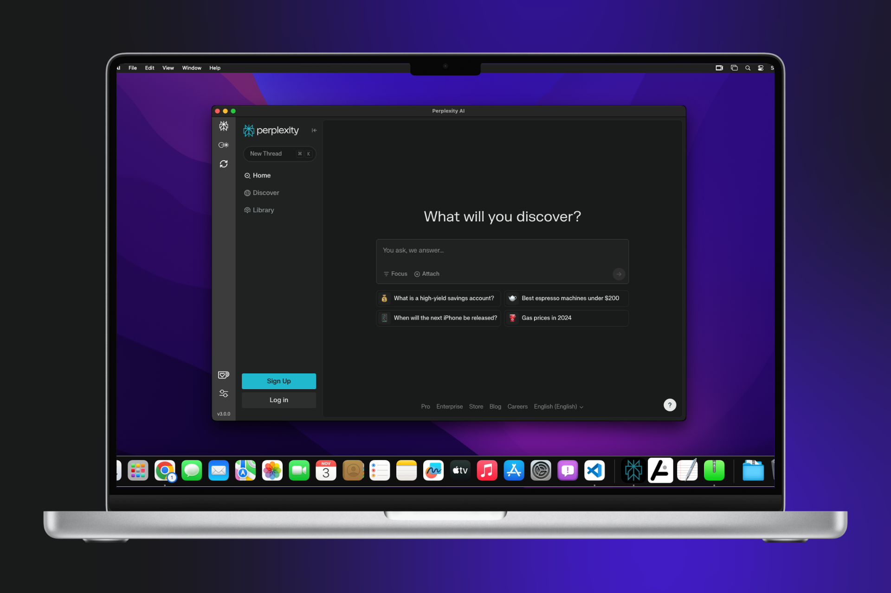

**Codebase Overhaul**
- Rebuilt from scratch for improved speed, stability, and efficiency, resulting in faster load times and smoother interactions.

**Unified Interface**
- All tools are now accessible within a single, cohesive interface, allowing seamless data retention when switching between AI modes.

**Sidebar Navigation**
- Updated sidebar design with a streamlined, icon-only layout for quick access to all features.

**Settings Section**
- Added the ability to set a default AI tool, removing the need to select an AI tool at each launch.
- Enabled shortcut customization and other personalization options.

**Customizable Shortcuts**
- Configurable shortcuts for essential actions, including switching AI modes, minimizing, restoring, sending to tray, and reloading the app.

**Update Notifications**
- Redesigned update dialog that fetches release notes from GitHub and displays them in markdown for better readability.

**Accidental Close Protection**
- Added a confirmation prompt to prevent accidental closure when work is in progress.

**Streamlined User Experience**
- Removed repetitive sign-up and sign-in prompts for a smoother experience.

**External Link Handling**
- External links now open in your default browser to keep the in-app experience focused.

**Usability Improvements**
- Visual enhancements and minor UI tweaks for easier navigation and a cleaner look.

---

**Upgrade now to experience the faster, smarter Perplexity AI v3.0.0!**